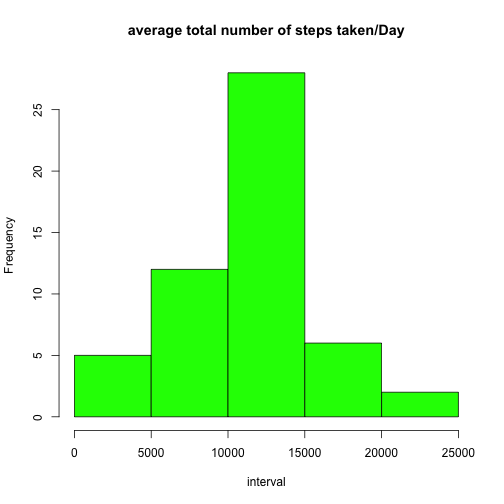
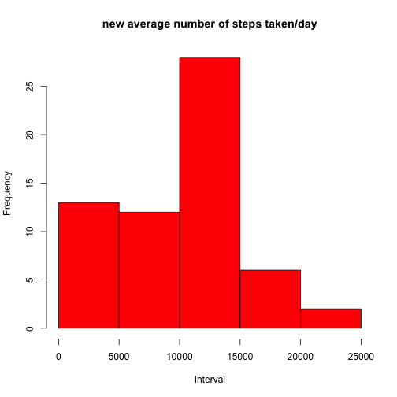

```r
data<-read.csv("/Users/wirelessdepot/Documents/Online courses/Data Science/reproducible /Assignment 1/activity.csv")
data$date<-as.Date(data$date)
```
#What is mean total number of steps taken per day?

```r
dailysteps<-aggregate(data$step,by=list(data$date), sum)

names(dailysteps)<-c("Date","Sum")
hist(dailysteps$Sum,col="green",main="average total number of steps taken/Day", xlab="interval")
```

 

```r
        ##mean
        mean(dailysteps$Sum,na.rm= T)
```

```
## [1] 10766.19
```

```r
        ##median
        median(dailysteps$Sum,na.rm= T)
```

```
## [1] 10765
```
##What is the average daily activity pattern?
###1.Make a time series plot (i.e. type = "l") of the 5-minute interval (x-axis) and the average number of steps taken, averaged across all days (y-axis)

```r
        Avg.S.I<-aggregate(data$step,by=list(data$interval), mean,na.rm=T)
        ##plot
       plot(Avg.S.I, type="l",
           xlab="Interval", 
           ylab="Average steps")
```

 

```r
        ## the interval which has maximum step value
```
###2.Which 5-minute interval, on average across all the days in the dataset, contains the maximum number of steps?

```r
             Avg.S.I[which(Avg.S.I$x == max(Avg.S.I$x,na.rm=T)),1]
```

```
## [1] 835
```

```r
             names(Avg.S.I)<-c("interval","steps")
```
            
##Imputing missing values 
###1Calculate and report the total number of missing values in the dataset (i.e. the total number of rows with NAs)
         
         ```r
         sum (is.na(data$steps))
         ```
         
         ```
         ## [1] 2304
         ```

###2.Devise a strategy for filling in all of the missing values in the dataset. The strategy does not need to be sophisticated. For example, you could use the mean/median for that day, or the mean for that 5-minute interval, etc.
the mean of the 5 minute interval will replace the missing values.

###3.Create a new dataset that is equal to the original dataset but with the missing data filled in.

```r
        dataFilled<-data
        dataFilled<- merge(dataFilled, Avg.S.I, by = "interval" )
  
        ## replace the NA values with avg values
        dataFilled$steps.x[is.na(dataFilled$steps.x)]<-dataFilled$steps.y   
```

```
## Warning in dataFilled$steps.x[is.na(dataFilled$steps.x)] <-
## dataFilled$steps.y: number of items to replace is not a multiple of
## replacement length
```
###4.Make a histogram of the total number of steps taken each day and Calculate and report the mean and median total number of steps taken per day. Do these values differ from the estimates from the first part of the assignment? What is the impact of imputing missing data on the estimates of the total daily number of steps?


```r
## new calculation after replacing NAs 
        dailysteps2<-aggregate(dataFilled$steps.x,by=list(dataFilled$date), sum)
        ##new histogram
        
        names(dailysteps2)<-c("Date","Sum")
        hist(dailysteps2$Sum, col="red", main="new average number of steps taken/day",xlab="Interval")
```

 

```r
        ##mean
        mean(dailysteps2$Sum,na.rm= T)
```

```
## [1] 9371.437
```

```r
        ##median
        median(dailysteps2$Sum,na.rm= T)
```

```
## [1] 10395
```
there is a considerable change in the result after replacing the missing values with averged values, and I assume it could have higher impact in some cases. so it is improtnat to keep eyes on the Missing Values in our analysisand and its impacts in the conclusion.

